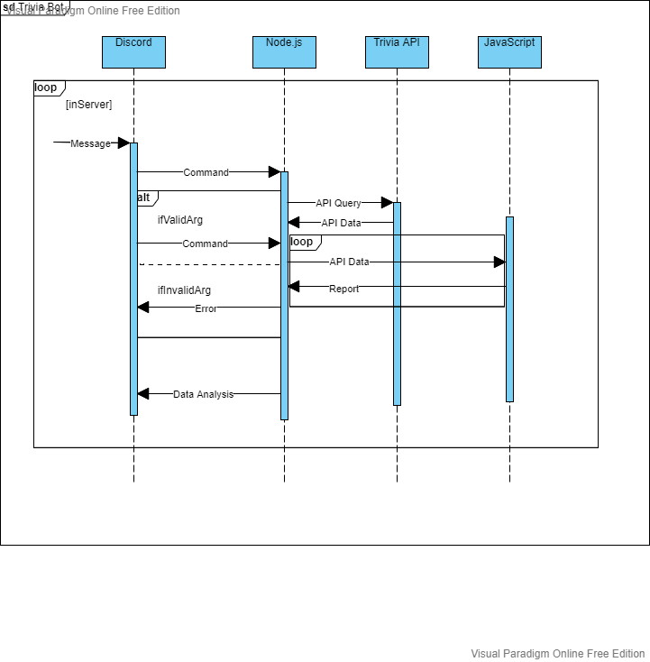
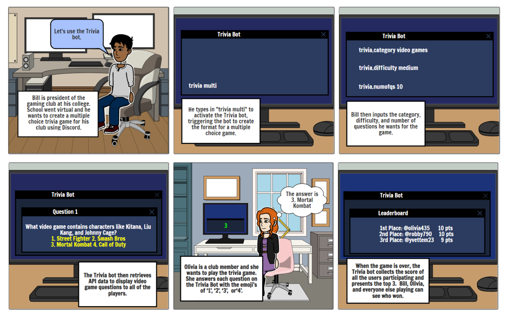

# Design Milestone

## Problem Statement

Due to the current pandemic, school has completely transitioned to being an online format for a majority of states within the US. Because of this transition, student communities have been disconnected from the college level all the way down to the middle school level. The constant routine of going in front of a laptop/computer to go to class for this extended amount of time has been detrimental for a lot of students' mental health. Students have become more disengaged from their classes and classwork because of this environment, and choose to be careless about their classes since they feel as though they are not learning and retaining the information they are being taught. Going to class physically is a pivotal part in community building and student mental health because humans in general are very social creatures, and when that social aspect is lacking in their lives, they become uninterested and lack the drive to feel passionate about their schoolwork. This is a major problem with all school curriculums because school is starting to become an environment that isn’t as fun as it used to be. Instead of showing excitement and dedication for new information and to be educated, students are slowly becoming more susceptible to solely focusing on submitting assignments, and putting their mind elsewhere. School does cause a lot of stress, and when students were in person, there were times throughout the school year where they were able to lean on their community for support, and have time for themselves whether it’s through fun events, games, or hanging out with friends. This was all stripped away once they were strapped to their computer screens all the time. 

## Bot Description

Our bot’s main functionality is to provide users with a fun/easy-to-use trivia API that can be used on Discord. People will interact with each other and answer a wide variety of questions given by the bot. As with any trivia game scores will be kept as an incentive to win. The users we specifically want to use this bot are people of school organizations such as clubs or greek life. The reasoning behind this is because these organizations already have group chats in order to communicate with each other, so this will be a great addition to their cats, providing a new way to interact online. To utilize the bot, for example the President of a club can organize a trivia session as part of their weekly meetings and activates the bot using a specific command. The bot would then be activated and any other users that are in the meeting will be able to interact which will make online meetings a bit more enjoyable.

Based upon the way our bot works, it essentially responds to events created by the user. For example, “trivia multi” activates the trivia bot. They will then input certain fields such as the category, difficulty, and the number of questions before they start. Finally, as the bot asks questions people will respond with their answers. Clearly, this represents the bot just responding to events more than a bot maintaining conversation with the user.

Our tagline is: “Be Educated. Be Fun. Be Trivia on Discord."


## Use Cases


## Design Sketches

### Sequence Flow Diagram



### Storyboard


## Architecture Design

```
- Create a diagram that illustrates the components of your bot, the platform it is embedded in, third party services it may use, data storage it may require, etc.
- Describe the architecture components in text.

This section should be several diagrams + paragraphs of text. This is the opportunity to really think through how you might build your system. Consider all the criteria listed here in your description. Generic architectures that do not properly reflect a solution will receive low scores.-
```

## Submission

Create a team repository for your bot, using the assigned github repository. Submit a link to your team repo. In your README.md, list all team members and their github ids. Add a DESIGN.md document (linked from README.md) with the following materials included.

## Deliverables

Problem Statement (15%)
Bot Description (10%)
Use Cases (15%)
Design Sketches (30%)
Architecture Design (30%)
