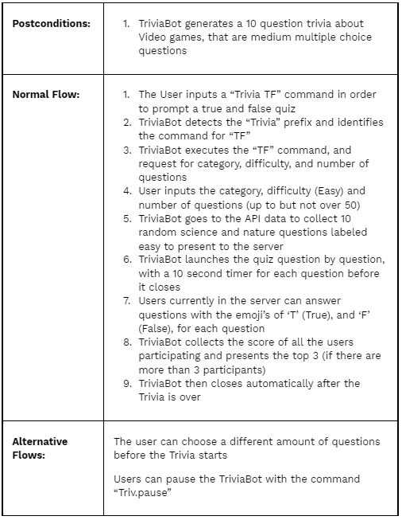
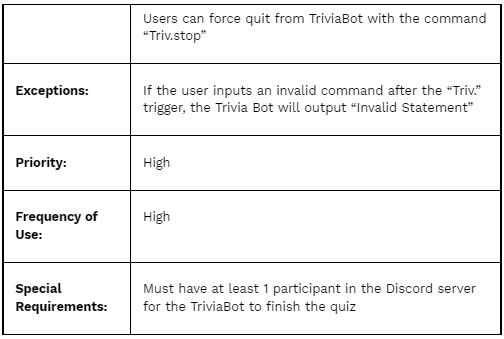
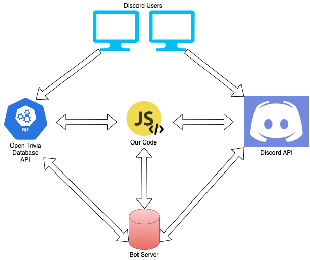

# Design Milestone

## Problem Statement

Due to the current pandemic, school has completely transitioned to being an online format for a majority of states within the US. Because of this transition, student communities have been disconnected from the college level all the way down to the middle school level. The constant routine of going in front of a laptop/computer to go to class for this extended amount of time has been detrimental for a lot of students' mental health. Students have become more disengaged from their classes and classwork because of this environment, and choose to be careless about their classes since they feel as though they are not learning and retaining the information they are being taught. Going to class physically is a pivotal part in community building and student mental health because humans in general are very social creatures, and when that social aspect is lacking in their lives, they become uninterested and lack the drive to feel passionate about their schoolwork. This is a major problem with all school curriculums because school is starting to become an environment that isn’t as fun as it used to be. Instead of showing excitement and dedication for new information and to be educated, students are slowly becoming more susceptible to solely focusing on submitting assignments, and putting their mind elsewhere. School does cause a lot of stress, and when students were in person, there were times throughout the school year where they were able to lean on their community for support, and have time for themselves whether it’s through fun events, games, or hanging out with friends. This was all stripped away once they were strapped to their computer screens all the time.

## Bot Description

Our bot’s main functionality is to provide users with a fun/easy-to-use trivia game that can be used on Discord. People will interact with each other and answer a wide variety of questions given by the bot. As with any trivia game scores will be kept as an incentive to win. The users we specifically want to use this bot are people of school organizations such as clubs or greek life. The reasoning behind this is because these organizations already have group chats in order to communicate with each other, so this will be a great addition to their chats, providing a new way to interact online. For example, to utilize the bot, the President of a club can organize a trivia session as part of their weekly meetings and they can activate the bot using a specific command. The bot would then be activated and any other users that are in the meeting will be able to interact and play a round of trivia, which will make online meetings a bit more enjoyable.

Based upon the way our bot works, it essentially responds to events created by the user. For example, “trivia multi” activates the trivia bot. They will then input certain fields such as the category, difficulty, and the number of questions before they start. Finally, as the bot asks questions people will respond with their answers. Clearly, this represents the bot just responding to events more than a bot maintaining conversation with the user.

Our tagline is: “Be Educated. Be Fun. Be Trivia on Discord."

## Use Cases

## Design Sketches

### Sequence Flow Diagram

### Storyboard

## Architecture Design

The above is a hollistic view of Trivia Bot's architecture. This includes all the APIs it utilizes, the platform its hosted on (Heroku), and how they interact with one another.

To start, a Discord user (can be on a computer or phone) will make a request to Trivia Bot to start a round of trivia. This request will be sent to the Discord API which will then be interpreted by the JavaScript code (back-end Node.js runtime environment). At this point, the request can either fail or succeed. If it fails, it is most likely due to the user using commands that the code doesn't recognize (like a spelling error, or just using a nonexistent command). If it succeeds, then there will be a request sent to the Open Trivia Database API (OTD) to retrieve trivia data according to the Discord user's request. The data being retrieved depends on many different factors: The user can ask for a trivia round with 10 questions, a trivia round specific to a certain category like 'Entertainment', choose difficulty level, and combination of all of these things, and much more. The OTD API will either respond with a status 200 and the desired data, or it will fail with an error (there are different kinds errors that can be returned).

As I just mentioned, once the OTD API has processed the request and come up with a response, that response will be sent back to the user after going through the Discord API (so that the response can be displayed to the user in the form of a Discord message). Assuming the response is good, the user can continue to interact with the Trivia Bot once they're recieved a response from the Trivia Bot. This cycle will repeat in a loop until there are no more trivia questions (the trivia round has concluded), until there's an error (errors can happen at any time!), or if the user terminates the trivia round.

An important part to note is that Trivia Bot will be hosted on Heroku (a cloud Platform-As-A-Service provider), and will be running 24/7 so that a user can access the Trivia Bot at any time. So, any time an API request is being sent or recieved, when it 'talks' to the code, it is interfacing with Heroku since that is where the code is being hosted. Additionally, there is no database element (as of right now); the only data that would need to be 'remembered' is every participant's trivia score, which becomes irrelevant when a new game starts. Unless we decide we'd like to have a global score component (a cumulative score variable that is a measure of how many trivia questions have been correctly answered over time), we probably won't need a database. This part still hasn't been decided on, since we won't know for certain how the functionality will work until we start development on this applciation, so this may change. The beauty of the development process is watching how ideas evolve into results, so we'll know more once we begin!

_Some concepts that weren't described in detail above that I'd like to make more clear:_ The Open Trivia Database API (OTD API) is a massive collection of trivia questions and categories that can be used in applications. There are many different categories of questions, different difficulty levels, and the questions can be multiple choice and/or true and false type of questions. All of the data Trivia Bot uses is being requested from the OTD API. Also, the Discord API is what will allow us to create a Discord Bot (the Trivia Bot) and is what will allow us to interact with users in the Discord application via messages and notifications. This API is extrememly vast and allows developers to write bots that are flexible in ther interactions with users, so the possibilities are nearly endless.
