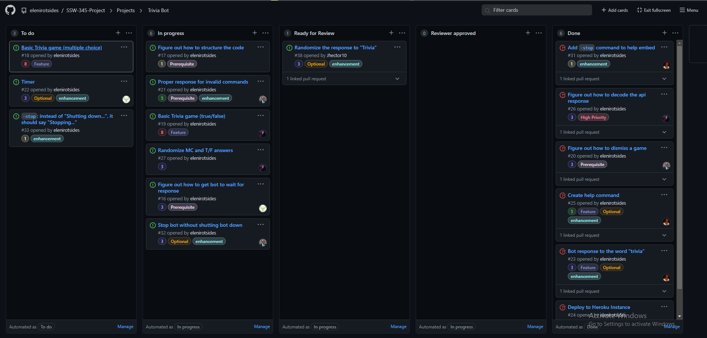
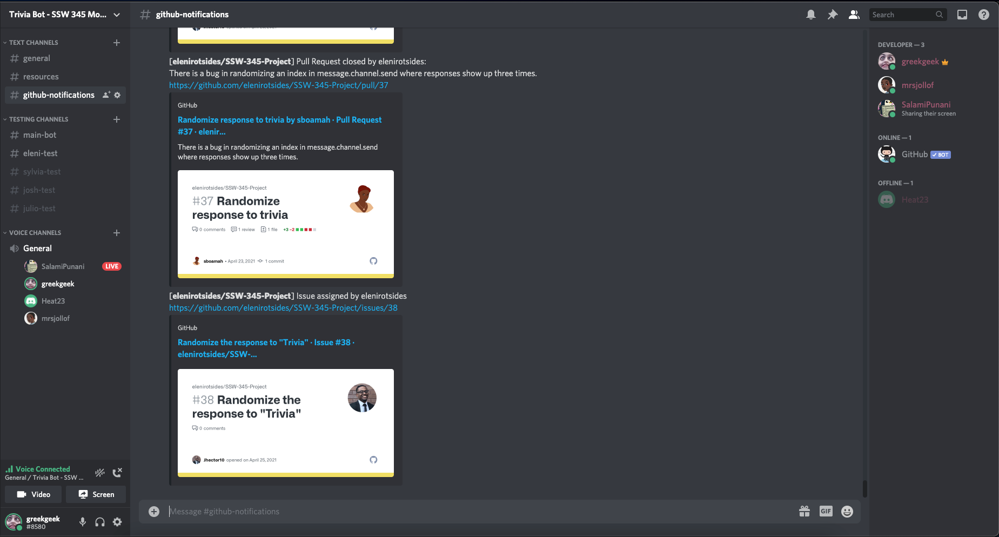
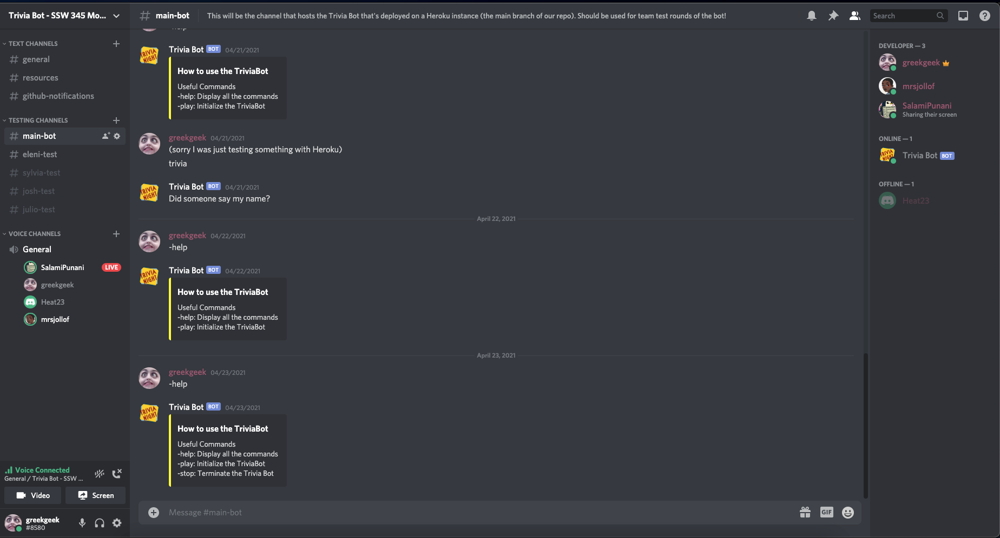
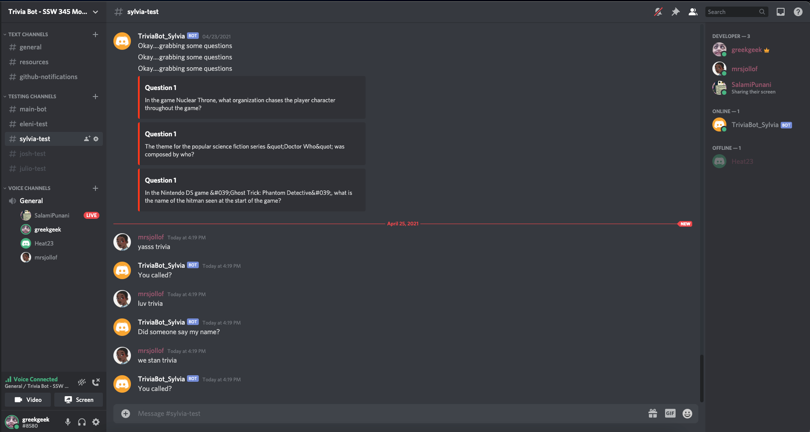

# Process Milestone 

## Story Creation

We have implemented a Project Kanban Board that is automated; when a member opens a Pull Request, the issue will be moved from To Do or In Progress to Ready for Review and when a PR has been merged into main, it'll be moved to Done. 

We categorized the issues with labels so that we can prioritize and understand how important each issue is and to indicate complexity. The purpose of this is to make sure that all members have an equal amount of work assigned to them, measured in complexity as opposed to being measured in the quantity of issues assigned to them.

## Tasks Update

### Incomplete Tasks:
- Create a basic True and False trivia game 
- Create a basic Multiple Choice trivia game 
- Have the bot await for a response
- Proper response for invalid commands
- Creation of a timer
- How to force stop Discord game without having the bot shut down (Optional)

### Complete Tasks:
- Randomized the response to the word "Trivia" in the channel (optional)
- Added a help command in an embed message (stop, play, help)
- Figure out how to dismiss/stop the game
- Deployed to Heroku Instance so that the bot is always live

## Process Reflection

During our current project timeline, the use of scrum meetings were not utilized. This was substituted by the use of a main discord channel that was always active in the event that tasks were completed and milestones were met. These "Ad-Hoc" meetings in the discord channel allowed for open communication at all times and if there was any road blocks with issues that we were trying to solve, we can help each other more efficiently (rather than strict meetings on a daily/weekly basis).

The use of Pull Requests, code review, and issues in the GitHub allowed for seamless collaboration among the team, and ensured the code is always up to date (with no merge conflicts). Because everybody has different strengths, paired programming is vital for the progression of the project and is a useful practice for learning from our teammates. 

Testing was made a priority in the beginning of the process, so all of the teammates created their own Discord bot for their own individual testing. This allowed us to test all of the changes that we have made locally, check to see if the enhancements are performing as intended before opening up pull requests. This is our own version of unit (manual) testing that ensures that changes made are up to par with our standards. 