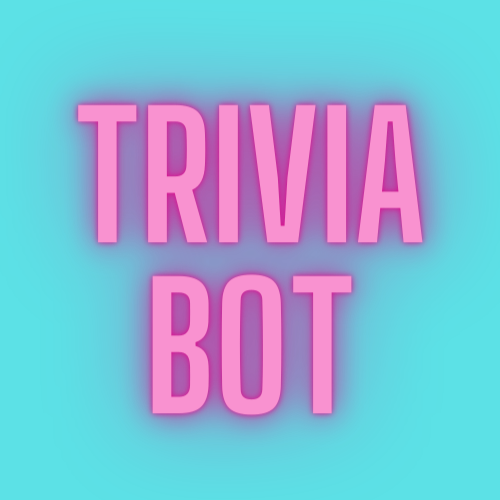

    
   
 
    
<a href="https://top.gg/bot/831974682709721099">

</a>

## What is Trivia Bot?

Trivia Bot is a fun, fully functional, and verified Discord bot that serves the purpose of satisfying your Trivia craving! There are many different modes of Trivia that you can play, either by yourself or with others in your Discord Server. The bot uses the Open Trivia Database API for the trivia questions that are used in the game, so shout out to them for the really cool API! You can find out more about that [here](https://opentdb.com/).

## Add to your server

Click [here](https://discord.com/api/oauth2/authorize?client_id=831974682709721099&permissions=157760&scope=bot) to add Trivia Bot to your Discord server! Tell all your friends, too!

## Commands

There are many different commands you can use to interact with Trivia Bot. _This section will be evolving as more features are continually added!_ Here is a list of the current commands:

-   `!tfchill` Starts a round of chill T/F Trivia.
-   `!tfcompetitive` Starts a round of competitive T/F Trivia.
-   `!mcchill` Starts a round of chill Multiple Choice Trivia.
-   `!mccompetitive` Starts a round of competitive Multiple Choice Trivia.
-   `!help` Lists out all the commands that Trivia Bot responds to, and what they do.
-   `!info` Responds with a Discord embed that contains links to `GitHub`, `Top.gg`, and the `Discord Support Server`
-   🛑 Stops the current Trivia game

The difference between `chill` and `competitive`:

`chill` allows all users to select an answer within the time limit
`competitive` only accepts the first correct answer; everyone else loses by default

You can also append any of the commands to `help` to learn more about the different game modes, like so:

-   `!help tfchill` Will give more detail about this specific game mode, for example.

## Sub Commands

**Trivia Bot now supports optional sub commands!**

So...what does this mean for you? Trivia Bot can now take `time [seconds]` as an optional sub command so that you can extend the time limit per question in a Trivia round! This was done to make the game more accessible for those that can't read as quickly as others, or simply, for those that just want to take their time playing!

_Please note: This option is only available for chill modes of gameplay. This is due to the nature of chill modes; competitive modes are meant to be quick, rapid-fire rounds which is why this option was not applied to competitive modes._

_Please note part 2: There will be more optional sub commands added in the future such as selecting more than 10 questions, specific category selection, and difficulty selection, to name a few. **Please stay tuned for these!**_

### How to use the Sub Commands

#### time [seconds]

Let's say you want to play a round of `tfchill` but want to make each question have a time limit of 20 seconds:

All you need to do is type the following: `!tfchill time 20`

By default, Trivia Bot will give you 10 seconds per question. So, if you don't provide `time [seconds]`, then the bot will default to 10.

**Limits:**

-   Minimum: 10 seconds
-   Maximum: 180 seconds
-   Can only be applied to `tfchill` or `mcchill` game modes

## Command Aliases

Sometimes you'll mispell something and sometimes you'll want a quicker way to interact with the bot. Below are a list of aliases that exist so that your original intention will be recognized:

-   `!halp`, `!hwlp`, `!hrlp` works for `!help`
-   `!mchill` works for `!mcchill`
-   `!mcompetitive`, `!mccomp`, `!mcomp` works for `!mccompetitive`
-   `!pong` works for `!ping`
-   `!tfcomp` works for `!tfcompetitive`

## Contributing

Please see [CONTRIBUTING.md](https://github.com/elenirotsides/Trivia-Bot/blob/main/CONTRIBUTING.MD) for instructions on how you can contribute to the development of this bot. Trivia Bot always welcomes PRs!

## Help

Discussions have been enabled on this repository, so please feel free to ask any questions, make suggestions, etc. over [here](https://github.com/elenirotsides/Trivia-Bot/discussions) if you'd like! Please report bugs by opening up an issue for it in the [Issues](https://github.com/elenirotsides/Trivia-Bot/issues) tab.

You can also join the Trivia Bot Support server and ask questions there, too:

## Known Limitations/Bugs

Trivia Bot is still an active work in progress and therefore, it has some _quirks_ that still need to be ironed out. (Contributions are welcomed and encouraged, and this is a great place to start if you're wanting to dip your toes in the codebase.) This is a list of the issues that will be fixed eventually, but until then, please know that they're there:

-   This happens in both chill and competitive modes.

    > User 1 selects choice B, unselects choice B, then selects choice C. The correct answer was C and the bot accepts User 1's choice even though only the first selection should be considered.

    The Discord API limits what can be done with reactions (which is how Trivia Bot collects answers). The solution would be to disregard any other clicks after the first attempt has been executed. The issue relevant to fixing this can be found by clicking [here](https://github.com/elenirotsides/Trivia-Bot/issues/52).

-   The bot will throw an error, can be seen [here](https://github.com/elenirotsides/Trivia-Bot/issues/110), about Permissions, but I have no idea what causes it or how to fix it. I am actively investigating this and I hope to find a solution soon!
