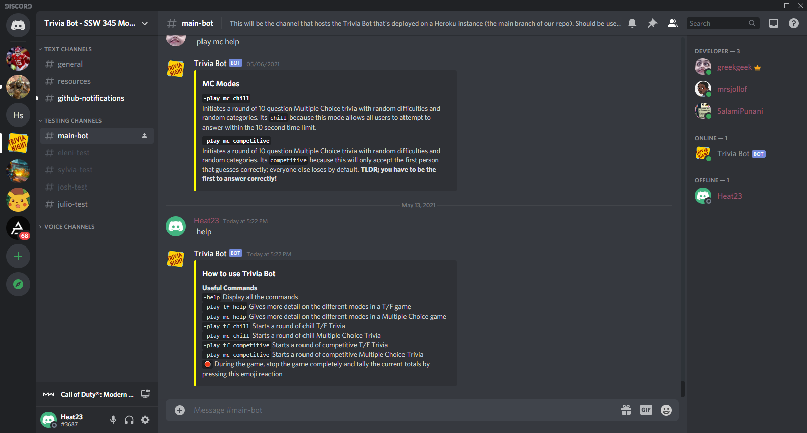
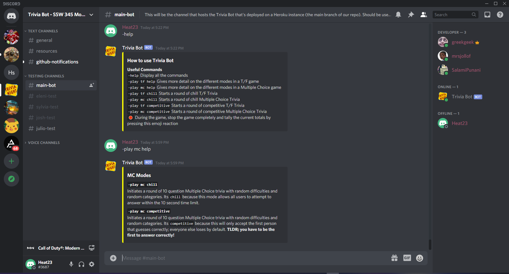
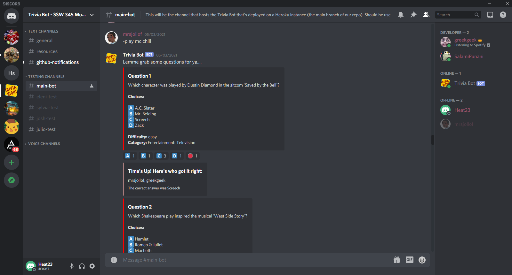
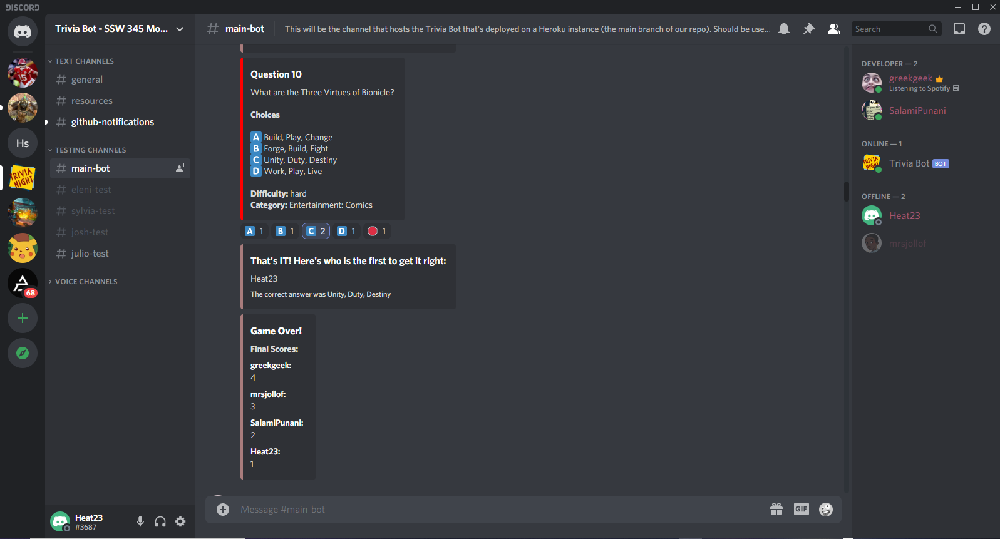

# Report

## Problem our Bot Solved

The problem that our bot solved was that we created a trivia game for those distant student (and non-student) communities that wish to play trivia with one another. Because of the pandemic, friends, family, and communities in general have not been as close as they have been. Staying in front of your computer screen for hours on end can be detrimental to one's mental health, so having the Trivia Bot as a great way to to not only have fun with friends, but also to take that mental break that we all need. When students become uninterested in what is being taught, that is where the Trivia Bot comes along, where you are able to have fun while also learning new things. Everybody loves those family and/or friend game nights, and adding this Trivia Bot (played on Discord) also helps to solve that problem.

## Primary Features

The main features our bot has includes two different types of trivia question styles (True/False and Multiple Choice), with each type having two different modes (Chill and Competitive). In order to view the different games and  modes, the user can activate the help command with `-help`.

Another method to view each feature and what it entails is by typing `-play mc` or `-play tf` followed by `help`. This will show a detailed desription of the specific modes you are interested in. For example, `-play mc help` produces the following.

Each game essentially works the same with the main difference being whether or not the game is being played in `chill` or `competitive` mode.
`Chill` mode allows for every user to be able to answer the question, and by the end of the 10 second time limit, all users who chose the correct answer will recieve a point. 

`Competitive` mode allows for multiple users to choose an answer as well, however, the bot stops listening for responses once someone gets the correct answer. This makes it more competitive since it is a matter of speed as well as intelligence. Here is an example of what you would see if you ran competitive mode for a True/False game.

Each game ends when the final question is answered and the bot displays a Leaderboard with the final scores. Also, it is important to note that each game has a stop feature shown in the previous screenshots by the stop emoji. Clicking this ends the current round and the bot proceeds to show the resulting leaderboard.

## Reflection on the Development Process

During our development process, we conducted a lot of research due to our unfamiliarity with implementing bots on Discord. Design methods helped the team to thoughtfully come up with a robust solution for our Trivia bot. Use cases allowed us to better understand our target user and what tasks they would have to complete in order to fully engage with the bot. UML and architecture diagrams additionally gave us a visual representation of how different platforms and servers would interact with each other, as well as recognizing how the Discord API, Trivia API, and Heroku would be integrated.

The implementation of the kanban board in our GitHub repository allowed for easy tracking, scheduling, and delegation of tasks for the entirety of the project. Whenever there were issues that were mentioned during team meetings, it would be implemented into the kanban for future delegation. Additionally, using the point system and other labels was helpful in knowing what issues to prioritize and implement chronologically. We labeled issues under different categories such as “Feature”, “Bug”, and “Enhancement” to best communicate what the issues were geared towards. Whenever issues were created and moved across the kanban board, the Github notifications were linked and accessed through the team’s Discord channel to best alert members of new goals.

Discord Developer Portal was a pivotal tool in us being able to leverage the information that is already out and develop the skill to read and understand documentation. Organization and using object oriented programming were the most difficult parts of our implementation process because we worked in one JavaScript file and due to the time constraint, did not plan for more scalable and maintainable code. During implementation, using different branches and creating pull requests (PRs) made working together and solving merge conflicts more efficient. Communication through Discord voice channels was the most helpful with regards to implementation because with pair programming and code reviews, collaboration made completing the bot in a timely manner easier. We were able to implement our own Trivia Bots in separate testing channels on Discord using our own bot tokens and local hosting. This method was very effective in testing the separate issues we had to solve.

Using Heroku, the team was able to host our completed bot on our main Discord channel by directly linking the main branch. This tool made testing in the main channel accessible to all team members at the same time, which made it easier to test simultaneous gameplay. Overall, it was a great learning experience to work with the fundamentals of an Agile approach and design methods. While design methods helped us understand and visualize our main goal, software processes gave us an avenue to reach our main goal. We would all utilize these techniques in the future.

## Limitations and Future Work

According to the Discord Documentation, there are certain limitations that exist in a bot account (also known as ‘Discord bot’):

1. Bots cannot accept normal invites
2. Bots cannot have friends and they cannot be added to group direct messages
3. Unlike user accounts, bots are not limited to the number of servers they can be added to

Overall, Discord bots are very flexible in what they can do mainly because the Discord API exposes a lot of the Discord functionality to developers; anything is possible!

As for the limitations of our bot’s functionality and features, Trivia Bot is currently capable of responding with 4 preset game modes and styles:

-   True/False chill
-   True/False competitive
-   Multiple Choice chill
-   Multiple Choice competitive

These are the only 4 options available to users in terms of the type of gameplay they can engage in with our bot (details on these modes are explained in the Primary Feature section above). However, this is not the final version of our bot, so we have a list of ideas and optimizations we’d like to implement to make our bot even better.

The ultimate goal for Trivia Bot is for it to be fully customizable and flexible in its gameplay options. The first step in doing this is to implement the ability to allow the user to select the time limit per question in a round of trivia. This will increase the accessibility of the game so that users that can’t read as fast as others will be able to play. Currently, the time limit per question is 10 seconds. Additionally, we’d like to allow the user to select how many questions they want in a round of trivia. The default is 10 questions, and that is what we currently have implemented. Next, we want to allow users to be able to select a question category; all questions in the given round will only fall under that question category. We’d also like to do the same thing for the difficulty level (easy, medium, or hard). All of these future features are fully in scope since the Open Trivia Database API we are using provides this data; we just have to dynamically pass in the query parameters when making the API call to request game questions.
